# Database Architecture & Schema Specification
**รายวิชา 310-2203 Cloud-Based Backend Integration System**  
**กลุ่ม 3 (Group 03) | ผู้รับผิดชอบ: Member 5 – Database Architecture & Core API Specialist**  
**เป้าหมาย:** รองรับ Part B (5 Public APIs), Bonus 3 (XML Import 1,000 Records), และ Bonus 4 (JSON Import 1,000 Records)

---

## 1. ภาพรวมโครงสร้างฐานข้อมูล (Database Overview)
ระบบฐานข้อมูลได้รับการออกแบบและพัฒนาบน **Microsoft SQL Server** (พร้อมรองรับ Entity Framework Core Code-First และ LocalDB/SQLite fallback) เพื่อเป็นศูนย์กลางการจัดเก็บข้อมูลจาก:
1. **5 External Public APIs (Part B):**
   - Open Library API (`OpenLibraryBooks`)
   - Google Books API (`GoogleBooks`)
   - REST Countries API (`Countries`)
   - Cat Facts API (`CatFacts`)
   - NASA Astronomy Picture of the Day (APOD) API (`NasaApods`)
2. **XML Data Processing & Bulk Import (Bonus 3):**
   - รองรับการ Import ข้อมูล XML 1,000 รายการ จาก Member 2 (`XmlRecords`)
3. **JSON Data Processing & Bulk Import (Bonus 4):**
   - รองรับการ Import ข้อมูล JSON 1,000 รายการ จาก Member 3 (`JsonRecords`)

---

## 2. Entity-Relationship Diagram (ERD)

```mermaid
erDiagram
    OpenLibraryBooks {
        int Id PK "IDENTITY(1,1)"
        string WorkKey "NVARCHAR(100) INDEX"
        string Title "NVARCHAR(500) INDEX"
        string Author "NVARCHAR(255) INDEX"
        int FirstPublishYear "INT NULL"
        string Isbn "NVARCHAR(50) NULL"
        string CoverUrl "NVARCHAR(1000) NULL"
        string RawJson "NVARCHAR(MAX) NULL"
        datetime CreatedAt "DATETIME2 DEFAULT UTC"
    }

    GoogleBooks {
        int Id PK "IDENTITY(1,1)"
        string GoogleId "NVARCHAR(100) INDEX"
        string Title "NVARCHAR(500) INDEX"
        string Authors "NVARCHAR(500) NULL"
        string Publisher "NVARCHAR(255) NULL"
        string PublishedDate "NVARCHAR(50) NULL"
        string Description "NVARCHAR(MAX) NULL"
        int PageCount "INT NULL"
        string Categories "NVARCHAR(255) NULL"
        string ThumbnailUrl "NVARCHAR(1000) NULL"
        string RawJson "NVARCHAR(MAX) NULL"
        datetime CreatedAt "DATETIME2 DEFAULT UTC"
    }

    Countries {
        int Id PK "IDENTITY(1,1)"
        string CommonName "NVARCHAR(255) INDEX"
        string OfficialName "NVARCHAR(500) NULL"
        string Cca2 "NVARCHAR(10) NULL"
        string Cca3 "NVARCHAR(10) NULL"
        string Capital "NVARCHAR(255) NULL"
        string Region "NVARCHAR(100) INDEX"
        string Subregion "NVARCHAR(100) NULL"
        bigint Population "BIGINT NULL"
        float Area "FLOAT NULL"
        string FlagUrl "NVARCHAR(1000) NULL"
        string RawJson "NVARCHAR(MAX) NULL"
        datetime CreatedAt "DATETIME2 DEFAULT UTC"
    }

    CatFacts {
        int Id PK "IDENTITY(1,1)"
        string Fact "NVARCHAR(MAX)"
        int Length "INT"
        datetime CreatedAt "DATETIME2 INDEX DEFAULT UTC"
    }

    NasaApods {
        int Id PK "IDENTITY(1,1)"
        string Date "NVARCHAR(50) INDEX"
        string Title "NVARCHAR(500) INDEX"
        string Explanation "NVARCHAR(MAX) NULL"
        string Url "NVARCHAR(1000) NULL"
        string HdUrl "NVARCHAR(1000) NULL"
        string MediaType "NVARCHAR(50) NULL"
        string Copyright "NVARCHAR(255) NULL"
        string RawJson "NVARCHAR(MAX) NULL"
        datetime CreatedAt "DATETIME2 DEFAULT UTC"
    }

    XmlRecords {
        int Id PK "IDENTITY(1,1)"
        string RecordId "NVARCHAR(100) INDEX"
        string Name "NVARCHAR(255) INDEX"
        string Category "NVARCHAR(100) INDEX"
        decimal Value "DECIMAL(18,2)"
        string Status "NVARCHAR(50) NULL"
        string Description "NVARCHAR(MAX) NULL"
        string RecordDate "NVARCHAR(50) NULL"
        string RawXml "NVARCHAR(MAX) NULL"
        datetime ImportedAt "DATETIME2 DEFAULT UTC"
    }

    JsonRecords {
        int Id PK "IDENTITY(1,1)"
        string RecordId "NVARCHAR(100) INDEX"
        string Title "NVARCHAR(255) INDEX"
        string Category "NVARCHAR(100) INDEX"
        decimal Amount "DECIMAL(18,2)"
        string Status "NVARCHAR(50) NULL"
        string Description "NVARCHAR(MAX) NULL"
        string RecordDate "NVARCHAR(50) NULL"
        string RawJson "NVARCHAR(MAX) NULL"
        datetime ImportedAt "DATETIME2 DEFAULT UTC"
    }
```

---

## 3. รายละเอียดโครงสร้างตาราง (Table Schema Details)

### 3.1 ตาราง `OpenLibraryBooks` (Part B - API 1)
| คอลัมน์ | ชนิดข้อมูล | Constraints | รายละเอียด |
|---|---|---|---|
| `Id` | `INT` | PK, IDENTITY(1,1) | รหัส Primary Key ของระบบ |
| `WorkKey` | `NVARCHAR(100)` | NOT NULL, INDEX | คีย์ระบุผลงานจาก Open Library (เช่น `/works/OL45804W`) |
| `Title` | `NVARCHAR(500)` | NOT NULL, INDEX | ชื่อหนังสือ |
| `Author` | `NVARCHAR(255)` | NULL, INDEX | ชื่อผู้แต่งหลัก |
| `FirstPublishYear` | `INT` | NULL | ปีที่พิมพ์ครั้งแรก |
| `Isbn` | `NVARCHAR(50)` | NULL | หมายเลข ISBN |
| `CoverUrl` | `NVARCHAR(1000)` | NULL | URL รูปภาพหน้าปก |
| `RawJson` | `NVARCHAR(MAX)` | NULL | สำเนา JSON ดั้งเดิมจาก API |
| `CreatedAt` | `DATETIME2` | NOT NULL, DEFAULT UTC | วันและเวลาที่บันทึกข้อมูล |

### 3.2 ตาราง `GoogleBooks` (Part B - API 2)
| คอลัมน์ | ชนิดข้อมูล | Constraints | รายละเอียด |
|---|---|---|---|
| `Id` | `INT` | PK, IDENTITY(1,1) | รหัส Primary Key ของระบบ |
| `GoogleId` | `NVARCHAR(100)` | NOT NULL, INDEX | Volume ID ของ Google Books API |
| `Title` | `NVARCHAR(500)` | NOT NULL, INDEX | ชื่อหนังสือ |
| `Authors` | `NVARCHAR(500)` | NULL | รายชื่อผู้แต่ง |
| `Publisher` | `NVARCHAR(255)` | NULL | สำนักพิมพ์ |
| `PublishedDate` | `NVARCHAR(50)` | NULL | วันที่เผยแพร่ |
| `Description` | `NVARCHAR(MAX)` | NULL | คำอธิบายเนื้อหาโดยย่อ |
| `PageCount` | `INT` | NULL | จำนวนหน้า |
| `Categories` | `NVARCHAR(255)` | NULL | หมวดหมู่หนังสือ |
| `ThumbnailUrl` | `NVARCHAR(1000)` | NULL | URL รูปภาพหน้าปก |
| `RawJson` | `NVARCHAR(MAX)` | NULL | สำเนา JSON ดั้งเดิมจาก API |
| `CreatedAt` | `DATETIME2` | NOT NULL, DEFAULT UTC | วันและเวลาที่บันทึกข้อมูล |

### 3.3 ตาราง `Countries` (Part B - API 3: REST Countries)
| คอลัมน์ | ชนิดข้อมูล | Constraints | รายละเอียด |
|---|---|---|---|
| `Id` | `INT` | PK, IDENTITY(1,1) | รหัส Primary Key ของระบบ |
| `CommonName` | `NVARCHAR(255)` | NOT NULL, INDEX | ชื่อประเทศทั่วไป |
| `OfficialName` | `NVARCHAR(500)` | NULL | ชื่อประเทศทางการ |
| `Cca2` | `NVARCHAR(10)` | NULL | รหัสประเทศ 2 ตัวอักษร |
| `Cca3` | `NVARCHAR(10)` | NULL | รหัสประเทศ 3 ตัวอักษร |
| `Capital` | `NVARCHAR(255)` | NULL | เมืองหลวง |
| `Region` | `NVARCHAR(100)` | NULL, INDEX | ภูมิภาค (Region) |
| `Subregion` | `NVARCHAR(100)` | NULL | ภูมิภาคย่อย |
| `Population` | `BIGINT` | NULL | จำนวนประชากร |
| `Area` | `FLOAT` | NULL | ขนาดพื้นที่ (ตร.กม.) |
| `FlagUrl` | `NVARCHAR(1000)` | NULL | URL รูปธงชาติ |
| `RawJson` | `NVARCHAR(MAX)` | NULL | ข้อมูล JSON ดั้งเดิม |
| `CreatedAt` | `DATETIME2` | NOT NULL, DEFAULT UTC | วันและเวลาที่บันทึกข้อมูล |

### 3.4 ตาราง `CatFacts` (Part B - API 4)
| คอลัมน์ | ชนิดข้อมูล | Constraints | รายละเอียด |
|---|---|---|---|
| `Id` | `INT` | PK, IDENTITY(1,1) | รหัส Primary Key ของระบบ |
| `Fact` | `NVARCHAR(MAX)` | NOT NULL | ข้อความเกร็ดความรู้แมว |
| `Length` | `INT` | NOT NULL | ความยาวตัวอักษร |
| `CreatedAt` | `DATETIME2` | NOT NULL, INDEX | วันและเวลาที่บันทึกข้อมูล |

### 3.5 ตาราง `NasaApods` (Part B - API 5: NASA APOD)
| คอลัมน์ | ชนิดข้อมูล | Constraints | รายละเอียด |
|---|---|---|---|
| `Id` | `INT` | PK, IDENTITY(1,1) | รหัส Primary Key ของระบบ |
| `Date` | `NVARCHAR(50)` | NOT NULL, INDEX | วันที่ของภาพดาราศาสตร์ (YYYY-MM-DD) |
| `Title` | `NVARCHAR(500)` | NOT NULL, INDEX | ชื่อภาพดาราศาสตร์ |
| `Explanation` | `NVARCHAR(MAX)` | NULL | คำอธิบายปรากฏการณ์ดาราศาสตร์ |
| `Url` | `NVARCHAR(1000)` | NULL | URL ภาพดาราศาสตร์มาตรฐาน |
| `HdUrl` | `NVARCHAR(1000)` | NULL | URL ภาพความละเอียดสูง (HD) |
| `MediaType` | `NVARCHAR(50)` | NULL | ชนิดสื่อ (`image` หรือ `video`) |
| `Copyright` | `NVARCHAR(255)` | NULL | เจ้าของลิขสิทธิ์ภาพ |
| `RawJson` | `NVARCHAR(MAX)` | NULL | ข้อมูล JSON ดั้งเดิม |
| `CreatedAt` | `DATETIME2` | NOT NULL, DEFAULT UTC | วันและเวลาที่บันทึกข้อมูล |

### 3.6 ตาราง `XmlRecords` (Bonus 3: XML Import 1,000 Records)
| คอลัมน์ | ชนิดข้อมูล | Constraints | รายละเอียด |
|---|---|---|---|
| `Id` | `INT` | PK, IDENTITY(1,1) | รหัส Primary Key ของระบบ |
| `RecordId` | `NVARCHAR(100)` | NOT NULL, INDEX | รหัสอ้างอิงจากไฟล์ XML (เช่น `XML-0001`) |
| `Name` | `NVARCHAR(255)` | NOT NULL, INDEX | ชื่อรายการ / สินค้า / วัตถุ |
| `Category` | `NVARCHAR(100)` | NULL, INDEX | หมวดหมู่ |
| `Value` | `DECIMAL(18,2)` | NOT NULL, DEFAULT 0.00 | มูลค่า / ราคา |
| `Status` | `NVARCHAR(50)` | NULL | สถานะของรายการ |
| `Description` | `NVARCHAR(MAX)` | NULL | คำอธิบายรายละเอียด |
| `RecordDate` | `NVARCHAR(50)` | NULL | วันที่ของเรคคอร์ด |
| `RawXml` | `NVARCHAR(MAX)` | NULL | แท็ก XML ดั้งเดิมของเรคคอร์ดนี้ |
| `ImportedAt` | `DATETIME2` | NOT NULL, DEFAULT UTC | วันและเวลาที่ทำการ Import เข้า SQL Server |

### 3.7 ตาราง `JsonRecords` (Bonus 4: JSON Import 1,000 Records)
| คอลัมน์ | ชนิดข้อมูล | Constraints | รายละเอียด |
|---|---|---|---|
| `Id` | `INT` | PK, IDENTITY(1,1) | รหัส Primary Key ของระบบ |
| `RecordId` | `NVARCHAR(100)` | NOT NULL, INDEX | รหัสอ้างอิงจากไฟล์ JSON (เช่น `JSON-0001`) |
| `Title` | `NVARCHAR(255)` | NOT NULL, INDEX | ชื่อรายการ / ธุรกรรม |
| `Category` | `NVARCHAR(100)` | NULL, INDEX | หมวดหมู่ |
| `Amount` | `DECIMAL(18,2)` | NOT NULL, DEFAULT 0.00 | ยอดเงิน / จำนวน |
| `Status` | `NVARCHAR(50)` | NULL | สถานะของธุรกรรม |
| `Description` | `NVARCHAR(MAX)` | NULL | รายละเอียดเพิ่มเติม |
| `RecordDate` | `NVARCHAR(50)` | NULL | วันที่ของเรคคอร์ด |
| `RawJson` | `NVARCHAR(MAX)` | NULL | JSON Object ดั้งเดิมของเรคคอร์ดนี้ |
| `ImportedAt` | `DATETIME2` | NOT NULL, DEFAULT UTC | วันและเวลาที่ทำการ Import เข้า SQL Server |

---

## 4. โครงสร้างไฟล์ SQL Scripts
สคริปต์ SQL ทั้งหมดถูกจัดวางไว้ในโฟลเดอร์ `Database/` ดังนี้:
1. `Database/01_CreateSchema.sql`: สร้างฐานข้อมูล `G3_Backend_DB`, ตารางทั้ง 7 ตาราง, คอนสเตรนต์ และ Non-clustered Indexes
2. `Database/02_SeedData.sql`: ข้อมูลตัวอย่างเริ่มต้น (Seed records) ครอบคลุมทั้ง 5 APIs และ XML/JSON
3. `Database/03_StoredProcedures.sql`: Stored Procedures และ Views ประกอบด้วย:
   - `dbo.vw_DashboardMetrics`: View สรุปยอดข้อมูลรวมทุกตาราง
   - `dbo.sp_GetDashboardSummary`: SP ดึงข้อมูลสรุปสำหรับ Dashboard (Bonus 5)
   - `dbo.sp_SearchAllBooks`: SP ค้นหาหนังสือแบบข้ามระบบ (Federated Search)
   - `dbo.sp_BulkInsertXmlRecords`: SP สำหรับรับก้อน XML ขนาดใหญ่และแตกโหนด Insert ลงตารางด้วย OPENXML
4. `Database/04_VerifyData.sql`: ชุดคำสั่งตรวจสอบและนับยอดเพื่อการทดสอบและการบันทึกวิดีโอ (Demo Video) ของ Member 6

---

## 5. สรุปความร่วมมือกับสมาชิกในกลุ่ม
- **Member 1 (Cloud & Infrastructure Lead):** สคริปต์ทั้งหมดพร้อมรันบน Azure VM ที่ติดตั้ง SQL Server / LocalDB และเชื่อมต่อกับ ASP.NET Core Web API ภายใต้โดเมน `g3-project.duckdns.org`
- **Member 2 (XML Specialist - Bonus 3):** สามารถส่งไฟล์ `1000records.xml` ผ่าน API Endpoint `/api/XmlRecords/import-file` หรือใช้ Stored Procedure `sp_BulkInsertXmlRecords`
- **Member 3 (JSON & Dashboard Lead - Bonus 4 & 5):** สามารถส่งไฟล์ `1000records.json` ผ่าน API Endpoint `/api/JsonRecords/import-file` และเรียกดูข้อมูลรวมผ่าน `/api/Dashboard/summary` เพื่อนำไปแสดงผลบน Dashboard UI
- **Member 4 (External API Specialist - Part B):** เมื่อ Member 4 ทำฟังก์ชันดึงข้อมูลจาก 5 Public APIs สามารถเรียก POST มาบันทึกลง SQL Server ผ่าน Core API ของ Member 5 ได้ทันที
- **Member 6 (AI-Log & QA Lead):** นำไฟล์ในโฟลเดอร์ `Database/*.sql` ไปรวมในโครงสร้างโปรเจกต์หลัก `Project_G3_Group03` และใช้ `04_VerifyData.sql` ในการบันทึกวิดีโอเดโมส่งอาจารย์
